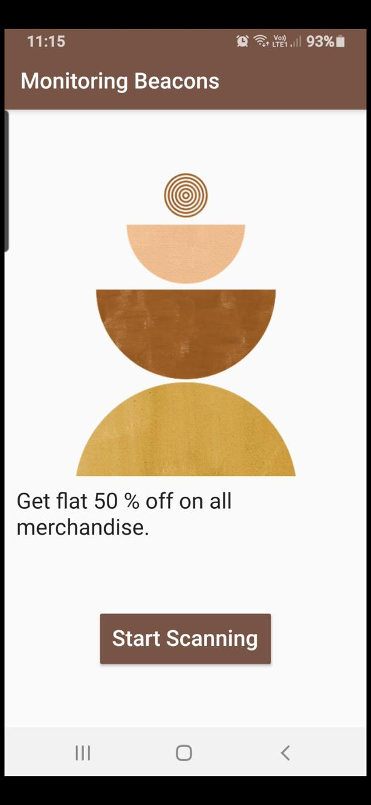

# Proximity Marketing App- Beaconer
>This project focuses on proximity marketing, enhancing the marketing capabilities and reach of merchants by displaying relevant promos, new launches, and other information on any product or service.
### This project is based on:
* Flutter based app using Beacon:  The merchant’s variant of the app will continuously transmit low energy ibeacon data packets and any smartphone passing nearby will detect the data packets and display the promotion, service etc.  Multiple smartphones will be able to display the promotions at the same time. Promotions will be fetched continuously from a cloud database.
## Tech Stack:
	  	
 ## Problem Statement: 
 * It will save the time of user as the user doesn't need to ask from the Merchant about the offers.  
 * Chances of Missing out of the great Deals.  

## About the Application
### Home Screen
* The screenshot shown below is the by default Home Screen of Reciever App. 
* There is a Start Scanning Button used to reciever messages by different Merchants. 
* 
 
 ### After Pressing Button
 * The screenshot shown below is the screen after pressing the button.  
 * The user will start getting the offers of shops nearby them. 
 * 

## Want to contribute?
### To start contributing refer to the following steps:
**1.** Make sure you have got flutter (including the command line tool) and Android Studio installed.

**2.**  Fork [this](git@github.com:Coding-Owls/Sender.git) repository.

**3.**  Clone your forked copy of the project.

     $ git clone https://github.com/<your_user_name>/Sender.git

**4.** Make your changes

**5.** Add and commit your changes

     $ git add . && git commit -m "<your_message>"
     
**6.** Push Code to Github under your branch 

     $ git push origin <branch_name> 

### Credits goes to these people:✨
<table>
	<tr>
		<td>
   
	</td>
	</tr>
</table>
